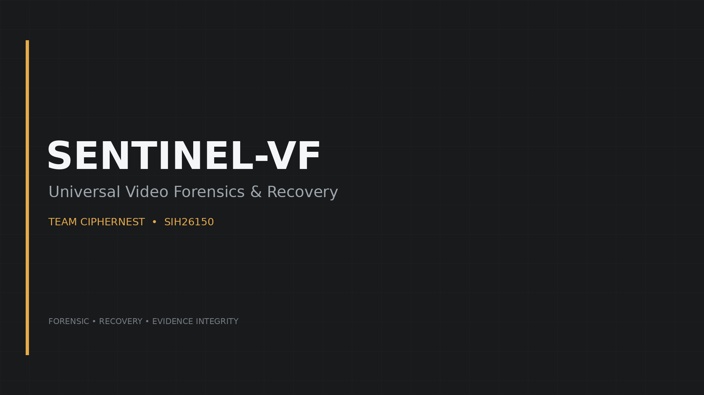
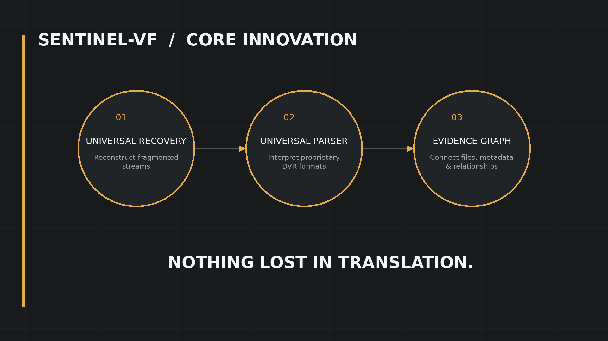
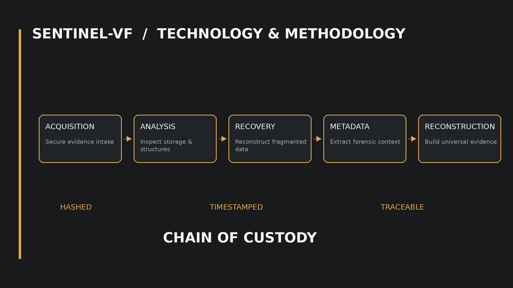

# 🔐 SENTINEL-VF

### Multi-Vendor DVR/NVR Forensic Analysis Tool

<p align="center">

</p>

---

## 📌 About the Project

**SENTINEL-VF** is a digital forensic analysis platform focused on the acquisition, recovery, and analysis of surveillance video evidence from different DVR/NVR environments.

The project is designed around the idea of treating surveillance recordings as forensic evidence, while preserving metadata, integrity, provenance, and investigative context.

---

## 🎯 Core Objectives

- 🔍 Analyze surveillance video evidence
- 🎥 Support multi-vendor DVR/NVR environments
- 📦 Extract video and metadata
- ♻️ Explore recovery of deleted surveillance footage
- 🕒 Normalize timestamps for investigation
- 🔐 Verify evidence integrity using SHA-256
- 📋 Support forensic reporting and evidence documentation
- 🧩 Handle proprietary surveillance formats

---

## ⚙️ Forensic Workflow

```text
Evidence Acquisition
        ↓
Device / Format Identification
        ↓
Parsing & Metadata Extraction
        ↓
Video Analysis
        ↓
Recovery
        ↓
Timeline / Timestamp Analysis
        ↓
Evidence Validation
        ↓
Forensic Reporting
```

---

## 🔒 Evidence Integrity

Evidence files are validated using SHA-256 hashing to detect tampering or corruption during acquisition and analysis.

```python
import hashlib

def sha256_file(path):
    h = hashlib.sha256()
    with open(path, "rb") as f:
        for chunk in iter(lambda: f.read(8192), b""):
            h.update(chunk)
    return h.hexdigest()

actual = sha256_file("evidence.mp4")
expected = "EXPECTED_HASH"

print("PASS" if actual == expected else "FAIL")
```

---

## 🧩 Three-Engine Architecture

<p align="center">
  
</p>

### 🔹 Universal Parser
Handles identification and parsing of supported DVR/NVR evidence formats.

### 🔹 Universal Recovery Engine
Focuses on recovery and reconstruction of surveillance footage where supported.

### 🔹 Evidence Intelligence
Organizes metadata and forensic context to support investigation and reporting.

---

## 🔎 Forensic Pipeline

<p align="center">
  
</p>

### Investigation Flow

```text
Acquisition
    ↓
Analysis
    ↓
Recovery
    ↓
Metadata Extraction
    ↓
Reconstruction
    ↓
Chain of Custody
```

---

## 📂 Repository Structure

```text
SENTINEL-VF/
│
├── assets/
│   ├── 01_title_card.png
│   ├── 02_three_engines.png
│   ├── 03_forensic_pipeline.png
│   └── 04_outro.png
│
├── docs/
│   ├── 05_subtitles_draft.srt
│   └── PRODUCTION_PACK_README.txt
│
└── README.md
```

---